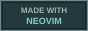

<!-- HEADER -->
<div align="center">



</div>

---

###  about

```bash
  name     → Derek Martinez
  role     → Backend Developer @ Highway
  degree   → Baylor University · B.S. Computer Science
```
---

###  languages & tools

<div align="center">



</div>

---

###  projects

| project | stack | what it does |
|---------|-------|-------------|
| **[PenTest Suite](https://github.com/djm1203/pentest-lab)** | Python · TUI | Modular CLI pentesting suite — dynamic module registry orchestrating Nmap, Sqlmap, Nuclei |
| **[VPN-Rust](https://github.com/djm1203/vpn-rust)** | Rust · Tokio | Hand-rolled secure tunnel — manual IP assignment, async I/O, rustls |

###  awards

```
NCL Team Game 2024 ··············· top 1% globally
├── Password Cracking ············ 100%   ████████████████████
├── Enumeration & Exploit ········ 88.9%  ██████████████████░░
├── Log Analysis ················· 79.2%  ████████████████░░░░
├── Cryptography ················· 78.6%  ████████████████░░░░
└── Scanning & Recon ············· 71.4%  ██████████████░░░░░░

Hivestorm CCDC ··················· Windows + Linux team defense
```

---

<!-- CONTRIBUTIONS -->
<div align="center">

<picture>
  <source media="(prefers-color-scheme: dark)" srcset="https://raw.githubusercontent.com/djm1203/djm1203/output/github-snake-dark.svg" />
  <source media="(prefers-color-scheme: light)" srcset="https://raw.githubusercontent.com/djm1203/djm1203/output/github-snake.svg" />
  
</picture>

</div>

---

<!-- FOOTER -->
<div align="center">



<br /><br />





<br /><br />


</div>
